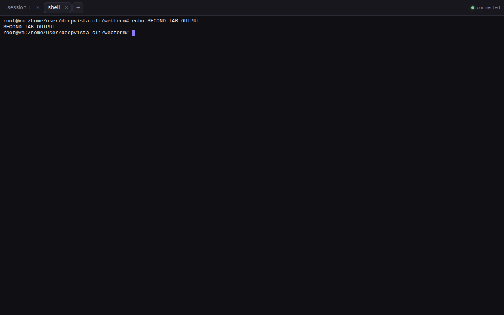

# webterm — a persistent multi-session web terminal

A browser terminal that behaves like a terminal app rather than a page: several
tabs, each a real PTY, all sharing one socket. Close the browser, come back, and
the tabs are still there with their scrollback — the sessions live in the server
process, not in the page.

Built from the findings in [`../docs/design/vibe-x-teardown.md`](../docs/design/vibe-x-teardown.md);
the earlier NAT-traversal research lives in [`../spikes/dv-remote/`](../spikes/dv-remote/).



## Run it

```bash
uv run --with aiohttp python webterm/server.py
#   web terminal:  http://127.0.0.1:7681/?token=…
```

Open the printed URL. The token moves into an httpOnly cookie on first load, so
refreshes and the socket upgrade work without keeping the secret in the address
bar.

```bash
# a different shell, a different starting directory, a fixed token
uv run --with aiohttp python webterm/server.py --command /bin/zsh --cwd ~/code --token "$WEBTERM_TOKEN"
```

Tests — both boot a real server; the second drives a real Chromium:

```bash
cd webterm
uv run --with aiohttp python api_test.py                       # 24 checks: HTTP, protocol, persistence
uv run --with aiohttp --with playwright python ui_test.py      # 18 checks: tabs, restore, reconnect, mobile
```

## What it does

| | |
| --- | --- |
| **Multiple sessions** | Tabs across the top; `+` offers your shells and every `Host` in `~/.ssh/config` as a one-click SSH tab, or type any command |
| **Nothing dies when you leave** | Sessions are owned by the server. Closing a tab, closing the browser, losing the network — none of it touches the PTY |
| **Auto-restore** | A fresh page lists live sessions and repaints each from a tail of its raw output stream, so colours and cursor position come back too |
| **Auto-reconnect** | Backoff reconnect, re-attach per session from its byte offset, status pill in the corner, and a check when the tab becomes visible again |
| **Instant tab switching** | Terminals are never destroyed, only hidden |
| **Real tty** | The child gets a controlling terminal (`TIOCSCTTY`), so `^C`, `^Z` and `fg` work, and resize reaches it via `TIOCSWINSZ` |
| **Touch** | Phones get an esc / ctrl / tab / arrows row and a sticky ctrl modifier |

## How it works

```
browser                        server (this process)
┌───────────────┐              ┌──────────────────────────────┐
│ xterm.js × N  │   1 × WSS    │ Connection: bounded out-queue │
│ tabs, offsets │◄────────────►│ SessionStore                  │
└───────────────┘  frames tag  │   Session: PTY + 1 MB ring    │
                   session id  │           + absolute offsets  │
                               └──────────────────────────────┘
                                        │ forkpty
                                   bash / ssh / claude
```

Three decisions carry the behaviour above:

**One socket for every tab.** Frames carry a session id, so N terminals share
one connection, one heartbeat and one reconnect path. N sockets would be N
independent things to go wrong on a flaky link.

**Output is addressed by absolute byte offset.** That makes the two reconnect
cases different operations instead of one compromise: a *warm* reconnect (blip,
backgrounded tab) asks for bytes after N and gets only those; a *cold* attach
(new browser) asks for a tail and repaints from raw stream. Conflating them
either loses output or repaints megabytes.

**The server never blocks on a slow client.** Each connection has a bounded
outbound queue. A client that cannot keep up with a `yes`-style flood has its
backlog dropped and is told to resync from a fresh tail — the correct end state
anyway, since nobody wants to read 40 MB of skipped scrollback.

## Wire protocol

Binary frames for terminal bytes (base64 would inflate every keystroke):

```
| kind: u8 | len(session_id): u8 | offset: u64be | session_id | payload |
```

`kind` 1 = output (offset = absolute stream position), 2 = input. Control frames
are JSON text: `attach{session,from}` (`from: null` = cold), `attached{offset,cold}`,
`resize`, `gap`, `resync`, `exit`, `gone`, `sessions`, `ping`/`pong`.

HTTP: `GET /api/sessions`, `POST /api/sessions`, `DELETE /api/sessions/{id}`,
`GET /api/profiles`, `GET /ws`.

## Security

This endpoint is a shell. Treat it that way.

- Binds **127.0.0.1** by default and refuses a non-loopback bind without an
  explicit `--token`.
- Token auth on every route, compared with `secrets.compare_digest`, then moved
  into an httpOnly `SameSite=Strict` cookie.
- Anyone holding the token gets a shell as you. For real remote use put it behind
  TLS and an authenticating proxy, or tunnel it (Tailscale, SSH forward, or the
  relay design in `docs/design/dv-remote.md`) rather than exposing it.

Not yet done, and deliberately listed rather than implied: no TLS of its own, no
per-user accounts, no audit log, no rate limiting on session creation.

## Limits

- **Sessions die with the server.** They survive browsers, tabs and networks,
  but not `Ctrl-C` on this process. Surviving that needs the session to live in
  a separate detached daemon — `tmux -CC` is the pragmatic answer and is the
  design in `docs/design/dv-remote.md`; it is not implemented here.
- **1 MB scrollback per session**, in memory, no disk spill. Longer absences
  overflow into a `gap` notice.
- **Every open session streams to every connected client.** That is what makes
  tab switching instant, and it is the wrong trade on a metered phone link.
- **One geometry per session**, set by whichever client resized last.
- Vendored `xterm.js` 5.5.0 and `addon-fit` (MIT) under `static/vendor/`.
